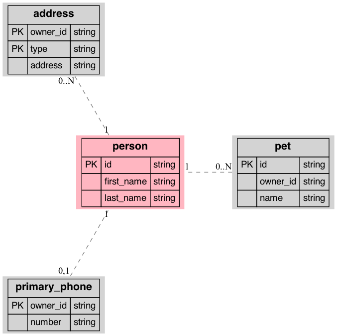

# SF-Data Structural Schema

This is a python library for documenting "anticipated" data structures. At Social Finance we often deal with
data that is supposed to have a certain structure, but very frequently the structure is not enforced. Variants
in column names, value formats (such as dates), no common way of indicating 'which' table a representation belongs
to etc.

The purpose of this library is to provide a way to document the expected structure of data, and to provide a way to
conform data to that structure and log any deviations.

Although the structure is primarly for tabular data, it can be used for any data structure, including hierarchical data
such as JSON & XML and provides a way to transform these into a relational datamodel.

The tool also includes the ability to generate documentation for the model, including a relational diagram.

Schemas can be defined in code, in JSON or in YAML, and can include additional metadata such as descriptions, and, in
the sample above, pretty colours for your documentation.